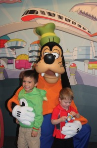
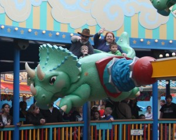

We just returned from a week at Disney World, down in Orlando.  As we try to recover and get back to normal, I wanted to share some highlights.

First off, we were down there so my lovely wife could run her first 1/2 marathon, the Disney Princess half.  She ran with her friend Amynah, and I'm very very proud of her.  It was a long journey getting there, and she did it! Yay Sweetie, yay!

Disney was good, and the magic was flying around. Instead of giving a play-by-play, here are some highlights of our trip:

Hollywood Studios:
<ul>

	<li>The kids enjoyed the character meet and greet breakfast at the diner.  The food was good, and having various characters come by the table to take pictures with the kids was great.  I wish they weren't in so much of a hurry though...For Doc Mcstuffins, we barely had time to get the camera out before she was moving along.</li>
</ul>
Magic Kingdom:
<ul>
	<li>We really liked the Monsters laugh floor.  The comedy was good and we liked the interactive nature of it.</li>
	<li>Buzz Lightyears ride was fun for me and Max.  We got the high score in the shoot-em style ride, maxing the score at 999999 points!</li>
	<li>None of us got sick on the spinning teacups, despite Max's efforts to make us spin faster and faster.</li>
	<li>Isaac's favorite thing of the day - The Hall of Presidents!  He loved it.</li>
</ul>
Epcot:
<ul>
	<li>Spaceship Earth was the favorite, with Little Nemo and the aquarium afterwards a close second.</li>
	<li>Since it was pouring rain, we didn't get a chance to explore as much as we'd have liked.  Something to look forward to next time.</li>
</ul>
Animal Kingdom:

<ul>
	<li>The safari was a hit.  Not only was it fun bouncing around in the back of the truck, seeing the animals was great.  Well, all except the lion. Max thought he was scary.  I see some trips to the zoo in our future.</li>
	<li>In Dinoland, the triceratops spin was good for both kids.  We rode it three times.</li>
</ul>

Here's a fun fact for you.  The Japanese kids get really excited seeing the characters. I got a kick out of seeing them because they were just so happy. After asking, we found out that at Disney Japan, they aren't allowed to touch the characters, which is why they're so happy when they could run up and give them all hugs.

It was a busy and fun filled week.  We're already thinking of going back in a year or two, since there was a ton of stuff we didn't get to see.
