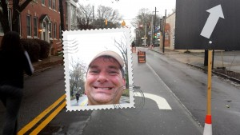

And so ends, the 9th running of the Georgia Marathon and Half Marathon.

My streak continues, as I've ran this every year.  This year, I chose to drop to the half-marathon instead of the full.

Highlights:

1. I thought the Expo was better than the last couple years. Max and I had a good time on the Brooks "Run Happy Island" boat.

2. Every year, I think "sure wish I could find some coffee, or a donut, or something..." This year I did.  Running through Little Five Points, there was no line at the Starbucks, and since I wasn't worried about my time, I stopped for a cup to go.  For some reason, for the next 2 miles, everyone else was giving me dirty looks and telling me I sucked.  It was Awesome!

3. Right after the splitting of the half and full distances, I was feeling good and there was a good couple miles of gentle downhill. I went into power-walk mode, and started passing people left and right, and having a good time. (I'd call it race walking, but my form was so bad that it would be a stretch.)

4. When the two races merged back together for a little bit before Piedmont Park, my timing was pretty good, and I got to catch the top men in the full coming through. Yay for them! The second place men's finisher was part of the group I used to run with, so that was cool to see the locals. One of the woman age group winners was also from that group.

5. Mile 9, coming off the hill at the top off Piedmont, got some motivation and started running. I met Sunil A. here, as he decided to run with me. He's another streaker, and a doctor up in Athens. We finished the race together, and had a pretty good time keeping each other going faster than we would have had we been alone.

6. The finishers medal has a typo on it. See if you can spot it in the picture below.

Since "<a href="http://www.cbs.com/shows/amazing_race/" target="_blank">The Amazing Race</a>" this season gave everyone camera's to take selfies, I decided to do the same thing during this race. My phone has a fun mode on it that uses both the front and back camera's at the same time, so I did that. Here are some of them:

 Mile 2

 Around mile 3, there is a nice view of downtown Atlanta.

 I always like passing by Martin Luther King Jr's church.

 Here I am with my coffee!

 Ah, here's happy, because I'm going the short way.

 Mile 9 in Piedmont Park.

 Me and Sunil at the obligatory finish line photo.

 This years finishers medal.

That was fun. See you next year.
