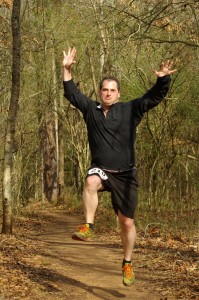
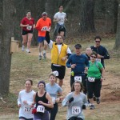

As you know, my challenge started on Friday, 2/29/08, with trying to run 29 miles. The plan was to do 16 miles on Friday, then a previously scheduled ½ marathon on Saturday to make 29 miles. Simple enough.

Friday went fine, and I actually got in a bit over 17 miles. I even finished feeling pretty good – barely sore at all. A good dinner and off to bed early got me through the night. Waking up and getting out of bed, I still wasn’t too bad. A little stiff, but I could tell that it would wear off soon as I walked around a bit.

A quick breakfast (oatmeal with honey and a tablespoon of peanut butter) and I was out the door. Getting to the race was no problem, but there was a traffic backup getting in, since they had park rangers collecting the parking fees. No problems with packet pickup, and I met up with the rest of the posse-Roman (who did 16 yesterday), Clay, and a co-worker of Roman’s whom I hadn’t met before were running and Brad and Ryan as support and photographers.

The race starts with a nice uphill, supposedly to separate out the pack. After powering up it, I definitely started feeling the burn from yesterday. And being in the crowd, it carried me a bit faster than I would have liked, but the first mile wasn’t bad. Over the next couple, it finally started to space out a bit and I was able to catch my breath. To make matters worse, at this point I was severely overheating! And I didn’t have any fluids with me, since the stations on the course were spaced where I thought was comfortable.

At around 3.5 miles, Brad and Ryan were waiting and cheering me on. It definitely made me feel better. (Especially as I was yelling out “Mile 22” as everyone around looked at me like I was delirious. Heck, maybe I was, but who cared. I carried on until the water stop at 4.6 miles, where they were waiting around again. This time, I unloaded what I needed from my pockets and handed off my jacket and extra shirt. (Sorry Ryan K, I wasn’t no longer wearing the team shirt.) Ahhhh…much better, and off again. The interesting thing at this stop was the teenage girl who showed up wondering if anyone had seen her mom.

Well, a couple miles later, definitely having cooled off and feeling better, there was a lady hanging out cheering people on with a camera. On a whim, I asked if she was looking for her daughter. Turns out she was, and wondering where she was since she missed her planned turn-off to find her. She was happy to know she was only a few minutes behind me. (Well, I assumed. I never saw her again to verify they found each other.

After the next water stop, and Team Photo there to capture my smiling face, the next thing of interest was passing a lady who asked if I had an asthma inhaler. (Uh, no, and would you really want to share one?) She wasn’t dying, but ran out of juice in hers so was looking for a backup. We hung out for a few miles before I left her behind for the last time. She asked me to find her friend at the finish and let her know she was coming along slowly.

The next mile or two was casual, then I hit the gas line hill. Ugh! That’s a cruel joke! Having avoided it every time we’ve ran here before, I didn’t know what to expect. Well, needless to say, it wasn’t so pleasant. Long and drawn out, I had a slow walk up and felt bad for asthma lady who had no idea that it was coming. The next mile or so until the next water stop were pretty much a blur. I know I had some coherent thoughts at that point, but I can’t remember what they were.

At the 10 mile stop, I had the lady check in to see if the medics could bring asthma medicine out. They weren’t sure, and decided to wait until the lady who needed it made it that far to check with her. That’s a good plan, I suppose, so I loaded up with a bunch of GU packs for the road, and took off. I hit 10 miles at just barely over 2 hours, and actually thought it was possible I’d set a PR for the ½ at this point.

Then I went. And went. Then I went some more. Eventually I saw a mile 11 marker. Wow, it was a half hour since mile 10! What the heck? Their mileage markers must be way off somewhere. My device told me I was at mile 12, so figured that was a bit more accurate. Well, I kept on truck’n.

Eventually, I crossed a road and knew the finish was within a ½ mile. I thought about pushing hard at this point. Really, I did. But the legs didn’t listen and I kept on poking along. Even when I went down the big hill and everyone was there cheering, I don’t think I picked up my speed more than 30 seconds/minute. (In case you didn’t figure it out yet, I was definitely feeling the burn at this point.)

Woo Whoo! I crossed the finished line and gave the guy my info. I never even looked at the clock to see what my time was. The gang was there, and we planned on meeting in an hour or so for lunch. I found the friend and told her her friend was coming. All is good. I just completed over 30 miles in 25 hours. Woo Whoo!

Next up, ING Marathon at the end of March.

P.S. Lunch was great. Had a Calzone and spent quality time with my wife and friends. My nap on the sofa was also good, even if not long enough. And after a bit of stretching, I can now get up off me chair without a problem. My beer is also good, even if it’s not a good microbrew from Seattle.

I should get a copy of the pictures in a week, next time I see Ryan.
I am disappointed in the race t-shirt. Besides the colors making it looks like a christmas shirt, it doesn't have the name of the race on it. It says "Xterra Trail Run, Georgia Series", which is fine because this is part of that series. However, I want it to brag that I ran a half marathon.

<a href="http://trail.motionbased.com/trail/activity/5073248">Someone else's GPS trailmap</a>

Carl Mesta is offering free downloads of his <a href="http://mestaphotos.smugmug.com">race photos</a>. Thanks Carl, it's a lot of work. This is the only shot I found than has a decent shot of me in it. (Hint-I'm at the far right in my usual yellow vest)

Bruce Tolbert Photography has put his <a href="http://www.smugmug.com/gallery/4440862_JZfAf#261139249">photos up</a>.
I spent some time talking to Bruce last year when we were both taking pictures. Nice guy, had a good time. His pictures are good (at least the ones of me :-) )

