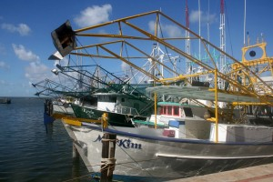
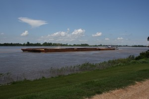
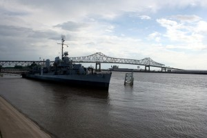
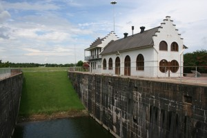
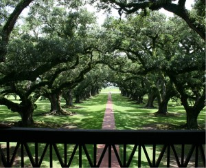
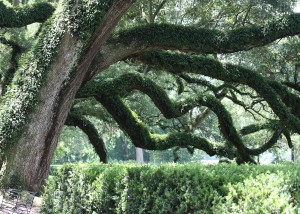
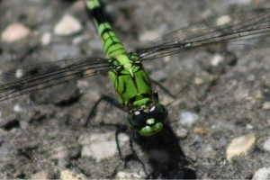

Trip to Baton Rouge part II. <a href="http://www.gonesomewhere.com/?p=78">(Click here to read part I</a>.)

So, after a late night of gambling, Friday got us up early to hit the road again. Of course, because we needed sustenance, we headed to the <a href="http://www.hardrockbiloxi.com/">Hard Rock Cafe</a> for breakfast and the opportunity to win a little more money. Then, off we went down highway 90 towards New Orleans.

The beach was pretty, and we stopped for some pictures. It wasn't until after we had everything setup that we really noticed we were standing on the foundation of a house that was wiped out by hurricane Katrina. (Well, at least we assume that, given all the damage we were seeing in this particular area.)

Instead of going straight to New Orleans, we headed up to the bridge across Lake Pontchartrain. Its the longest bridge over open water in the world, so we felt the need to go over it. However, after the first 10 miles, it started to get a little boring (it is 24 or 25 miles long). We then circled back down to the city, cruised around a little bit, then headed up a scenic byway towards Baton Rouge. (We were going to see more of the tourist stuff, then decided it would be better as a full day of site-seeing, so we put it off.)

Okay, to skip some boring stuff, we passed some plantations, got to our hotel, wandered around town for a little while seeing some sites, then picked my grandmother up from the airport.

Saturday, we headed back out to see the plantations we skipped yesterday. The one that really interested us was <a href="http://www.oakalleyplantation.com/">Oak Alley</a>, so that's where we went. The tour was interesting, and we got some great pictures of the grounds (we weren't allowed to take pictures inside).

Heading back into town along highway 1, we passed many old homes and some locks heading off the river. (They were long since dammed up and no longer in use. But still neat to see.)

Saturday evening was topped off by a party. We hung out with friends and family (a whole lot of cousins), ate some good cajun food and enjoyed ourselves. (And the food was all kosher. Apparently there is a place in New Orleans to get good kosher sausage.)

Sunday, we went to the the wedding. (The groom is my first cousin, once removed.) It was nice, and the reception afterwards was good. Again, a lot of quality time was spent with all the cousins from all over the place. We got caught up with all the family happenings, and know all the gossip now.

Afterwards, some of us headed out for more site seeing and dinner.

Some shrimp boats in Biloxi, Mississippi.

A barge heading up the Mississippi River.

The USS Kidd, a restored WWII destroy is parked along the river front in Baton Rouge.

This is an old, blocked off lock on Highway 1, between Plaquemine and Turnerville, just a bit outside Baton Rouge.

A shot of Oak Alley, taken from the balcony of the mansion. Right at the end of this alley is a small road - on the other side of the road is the levee holding in the Mississippi. At the time the plantation was built, the levee was shorter and the house could be seen from the river. It became a landmark and the sailors called it Oak Alley, so the name of the plantation was changed from the original French name.

An old oak tree

This, being the South, had lots of bugs. There were tons of dragonflies around, so of course I had to take a picture.

