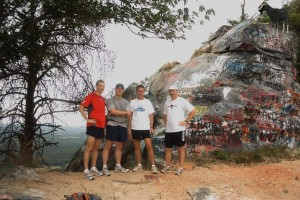
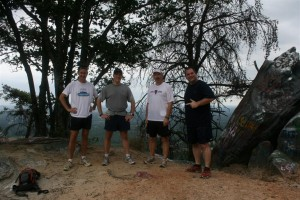
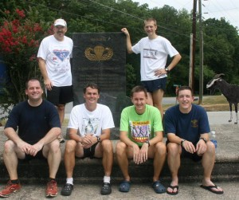

"War! What is it good for? Absolutely Nothing!"

Today, a hearty group of 6 took off up <a href="http://en.wikipedia.org/wiki/Currahee_Mountain">Currahee Mountain</a>. (Brad, Duane, Dustin,  Keith, Ryan and myself. El Goat was awol again.)  This mountain, the southernmost peak in the Blue Ridge mountain range, gives us a bit of history in the area. Back in World War II, there was a paratrooper training camp here. The soldiers used to run up and down this route, giving the saying "3 miles up, 3 miles down."

As you can probably guess, the road to the top is around 3 miles long. And it's uphill. You turn around, it's down hill for 3 miles.  In reality, the first two miles give you a bit of a rolling climb, and actually isn't horrible. Tough, but not insane. However, at one point, you hit a switchback, then start going up. And up. Then up some more.  Overall, I believe there is over a 900 foot gain, and I'd guess the majority of it is in that last mile.

At the top, there were a bunch of local high school kids screwing around and painting their name on the rock. Apparently, this is the right of passage tradition up here. From the pictures, you can get an idea of the height and the artistic ability of the local kids.

 
Part of our group at the top of the mountain

&nbsp;

 Another view of some of us at the top

Although many profound things were said on this trip, the quote to remember came from Coach K: "It's bigger an I thought it would be." In the front seat of the car, we could only assume he was talking about the mountain you could see out the front window. Duane was too busy laughing to confirm this, and Brad in the back with him was staying suspiciously quiet.

This run was also a <a href="http://www.runforthefallen.org">Run for the Fallen</a> group run. Today was their final run across the country in memory of all the soldiers killed in Iraq. I had planned on a run today for this, and talking to our group ahead of time, they concurred that I could share this time on this run to think about this.

At the base of the mountain, there is a small memorial for the regiments that trained here. I was going to give a speech and talk about the current war, read off the number of dead, and all that. But in the end, decided not to. We all have our personal thoughts on it, and that's enough. And hence, the quote from the song at the top.

 Our gang at the base of the mountain

